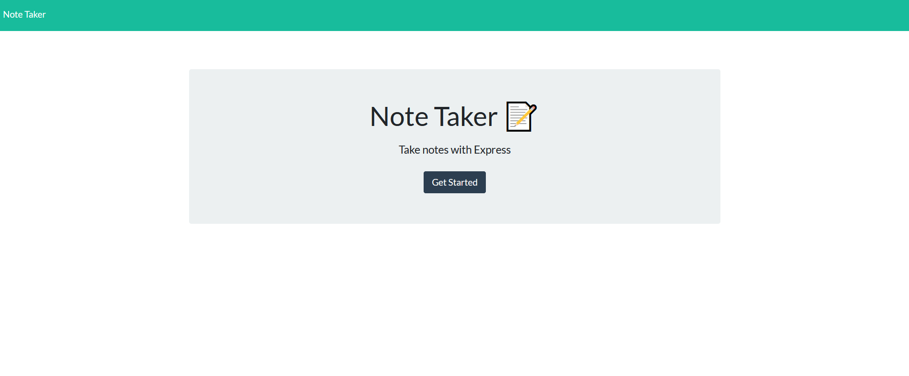
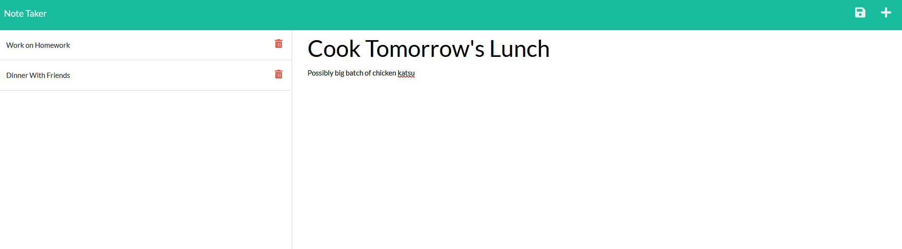

# Note Taker  

## Description

This project is an application that allows a user to create notes that are stored persistently. These notes can be added, deleted, and referenced again. All this is possible with express.js providing server infrastructure. This project was deployed on heroku.

## Packages and Installation

This project uses express.js to handle server infrastructure. Simply visiting the deployed app on heroku allows a user to use the app, without installation.

## Usage Instructions 

Upon booting the app, a user will be presented with a front page that says "Note Taker: Take notes with Express." Upon clicking "get started," they are taken to an interface with a blank note title and note text. Typing both a title and text in will make a save icon show up in the right side of the app's header. Clicking this save icon will add the note title to the left column alongside a delete icon. Clicking this note again will bring up the note again for reference. Upon clicking the trash/delete icon, the note will be deleted. Reloading at any time in this process will once again render the notes.

## License 

 

"Permissions of this strong copyleft license are conditioned on making available complete source code of licensed works and modifications, which include larger works using a licensed work, under the same license. Copyright and license notices must be preserved. Contributors provide an express grant of patent rights."

Read more about this license at: https://choosealicense.com/licenses/gpl-3.0/

## Screenshots

* Front Page

* Notes Page

## Github Repository Link & Walkthrough Video

GitHub Repository: https://github.com/voravichs/note-taker

Heroku Deployment: https://note-taker-vs.herokuapp.com/

